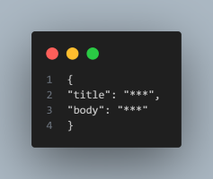

# A Node.js API for Posting and Retrieving Content

This Node.js API allows users to post content by sending a POST request to http://localhost:3000/post, with the post data structured in json format as follows:

Both the 'title' and 'body' should be typed in lowercase. Input validation is applied to ensure the data meets specific length requirements: the title must be between 4 and 150 characters, and the body must be between 4 and 2000 characters. If any validation errors occur, the API responds with a 400 status code and an error message. To retrieve posted content, send a GET request to http://localhost:3000/."

Configuration:

- Inside the ".env" folder, locate the "MONGO_URI" variable.
- Replace the "\*\*\*\*" signs in the variable with your MongoDB Atlas database URI.
